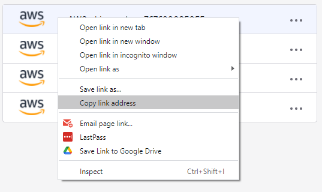

# Gimme AWS Creds

[![][license img]][license]
[](https://travis-ci.org/Nike-Inc/gimme-aws-creds)

***This README is for Windows users.*** For Linux/MacOS users - please read [README-Linux.md](README-Linux.md).

gimme-aws-creds is a CLI that utilizes an [Okta](https://www.okta.com/) IdP via SAML to acquire temporary AWS credentials via AWS STS.

Okta is a SAML identity provider (IdP), that can be easily set-up to do SSO to your AWS console. Okta does offer an [OSS java CLI]((https://github.com/oktadeveloper/okta-aws-cli-assume-role)) tool to obtain temporary AWS credentials, but I found it needs more information than the average Okta user would have and doesn't scale well if have more than one Okta App.

With gimme-aws-creds all you need to know is your username, password, Okta url and MFA token, if MFA is enabled. gimme-aws-creds gives you the option to select which Okta AWS application and role you want credentials for. Alternatively, you can pre-configure the app and role name by passing -c or editing the config file. This is all covered in the usage section.

## Installation

Clone the repository and then switch into it:

```bash
git clone https://github.com/pavel-lechenko/gimme-aws-creds-win.git
cd gimme-aws-creds-win
```

Run installation script:

```powershell
bin\Install-GimmeAwsCreds.ps1
```

## Configuration

To set-up the configuration run:

```powershell
bin\Set-GimmeAwsCredsProfile.ps1
```

You can also set up different Okta configuration profiles, this useful if you have multiple Okta accounts or environments you need credentials for. You can use the configuration wizard or run:

```powershell
bin\Set-GimmeAwsCredsProfile.ps1 -AWSProfile <ProfileName>
```

A configuration wizard will prompt you to enter the necessary configuration parameters for the tool to run, the only one that is required is the `okta_org_url`. The configuration file is written to `~/.okta_aws_login_config`.

- conf_profile - This sets the Okta configuration profile name, the default is DEFAULT.
- okta_org_url - This is your Okta organization url, which is typically something like `https://companyname.okta.com`.
- okta_auth_server - [Okta API Authorization Server](https://help.okta.com/en/prev/Content/Topics/Security/API_Access.htm) used for OpenID Connect authentication for gimme-creds-lambda. Please leave it empty.
- client_id - OAuth client ID for gimme-creds-lambda. Please leave it empty.
- gimme_creds_server - Please use `appurl`
  - URL for gimme-creds-lambda
  - 'internal' for direct interaction with the Okta APIs (`OKTA_API_KEY` environment variable required)
  - 'appurl' to set an aws application link url. This setting removes the need of an OKTA API key.
- write_aws_creds - True or False - If True, the AWS credentials will be written to `~/.aws/credentials` otherwise it will be written to stdout. Please enter `n`.
- cred_profile - If writing to the AWS cred file, this sets the name of the AWS credential profile - Please use `role`.
  - The reserved word `role` will use the name component of the role arn as the profile name. i.e. arn:aws:iam::123456789012:role/okta-1234-role becomes section [okta-1234-role] in the aws credentials file
  - The reserved word `acc-role` will use the name component of the role arn prepended with account number (or alias if `resolve_aws_alias` is set to y) to avoid collisions, i.e. arn:aws:iam::123456789012:role/okta-1234-role becomes section [123456789012-okta-1234-role], or if `resolve_aws_alias` [<my alias>-okta-1234-role] in the aws credentials file
  - If set to `default` then the temp creds will be stored in the default profile
  - Note: if there are multiple roles, and `default` is selected it will be overwritten multiple times and last role wins. The same happens when `role` is selected and you have many accounts with the same role names. Consider using `acc-role` if this happens.
- aws_appname - This is optional. The Okta AWS App name, which has the role you want to assume.
- aws_rolename - This is optional. The ARN of the role you want temporary AWS credentials for.  The reserved word 'all' can be used to get and store credentials for every role the user is permissioned for - PLease use `all`.
- aws_default_duration = This is optional. Lifetime for temporary credentials, in seconds. Defaults to 1 hour (3600)
- app_url - If using 'appurl' setting for gimme_creds_server, this sets the url to the aws application configured in Okta. It is typically something like <https://something.okta[preview].com/home/amazon_aws/app_instance_id/something>.



- okta_username - use this username to authenticate
- preferred_mfa_type - automatically select a particular device when prompted for MFA:
  - push - Okta Verify App push or DUO push (depends on okta supplied provider type)
  - token:software:totp - OTP using the Okta Verify App
  - token:hardware - OTP using hardware like Yubikey
  - call - OTP via Voice call
  - sms - OTP via SMS message
  - web - DUO uses localhost webbrowser to support push|call|passcode
  - passcode - DUO uses `OKTA_MFA_CODE` or `--mfa-code` if set, or prompts user for passcode(OTP).
- resolve_aws_alias - y or n. If yes, gimme-aws-creds will try to resolve AWS account ids with respective alias names (default: n). This option can also be set interactively in the command line using `-r` or `--resolve` parameter - Please enter `n`
- include_path - (optional) Includes full role path to the role name in AWS credential profile name. (default: n).  If `y`: `<acct>-/some/path/administrator`. If `n`: `<acct>-administrator` - Please enter `n`
- remember_device - y or n. If yes, the MFA device will be remembered by Okta service for a limited time. This option can also be set interactively in the command line using `-m` or `--remember-device` - Please enter `n`
- output_format - `json` or `export`, determines default credential output format, can be also specified by `--output-format FORMAT` and `-o FORMAT`.

Here is the example of `~/.okta_aws_login_config`:

```ini
[DEFAULT]
okta_username = firstname.lastname@your-org.com
okta_org_url = https://your-org.okta.com
aws_rolename = all
cred_profile = role
aws_default_duration = 3600
gimme_creds_server = appurl
include_path = False
output_format = export
preferred_mfa_type = push
remember_device = False
resolve_aws_alias = False
write_aws_creds = False

[myprofile]
app_url = https://your-org.okta.com/home/amazon_aws/1234567890abcdefghi/123
aws_default_duration = 3600
cred_profile = role
gimme_creds_server = appurl
include_path = False
output_format = export
remember_device = False
resolve_aws_alias = False
write_aws_creds = False
```

This script will create gimme-aws-creds profile and also it will create a profile for AWS CLI by adding a profile record to file `~/.aws/config`.

## Configuration File

The config file follows a [configfile](https://docs.python.org/3/library/configparser.html) format.
By default, it is located in $HOME/.okta_aws_login_config

Example file:

```ini
[myprofile]
client_id = myclient_id
```

Configurations can inherit from other configurations to share common configuration parameters.

```ini
[my-base-profile]
client_id = myclient_id
[myprofile]
inherits = my-base-profile
aws_rolename = my-role
```

## Usage

### If you are running in non-elevated session (As User)

After you created a profile you have to set the environment variable `$Env:AWS_PROFILE`. Then run desired AWS CLI command.

Below is an example:

```powershell
$Env:AWS_PROFILE = 'myprofile'

aws sts get-caller-identity
```

You can also use AWS CLI parameter `--profile` instead of using the environment variable `AWS_PROFILE`:

```bash
aws sts get-caller-identity --profile myprofile
```

### If you are running in elevated session (As Administrator)

After you created a profile you have to set the environment variable `$Env:AWS_PROFILE`. Then run the script `bin\Invoke-GimmeAwsCreds.ps1` which will prompt you to select the desired role, enter the ping and touch your Yubikey token. The script will set enviroment variables `AWS_ACCESS_KEY_ID` and `AWS_SECRET_ACCESS_KEY` for you. Then you have to run desired AWS CLI command.

Below is an example:

```powershell
$Env:AWS_PROFILE = 'myprofile'

cd <gimme-aws-creds-win directory>
bin\Invoke-GimmeAwsCreds.ps1

aws sts get-caller-identity
```

### Sample output

```text
Using password from keyring for firstname.lastname@your-org.com
Multi-factor Authentication required.
Okta Verify App: SmartPhone_IPhone: iPhone selected
Okta Verify push sent...

Device token saved!

Multi-factor Authentication required.
Preferred factor type of push not available.
Pick a factor:
[0] webauthn: YubiKey 5 FIPS with NFC
Selection: 0
Challenge with security keys ...
Please enter PIN:

Touch your authenticator device now...

Please choose desired role:
[0] arn:aws:iam::123456789012:role/your-org-power
[1] arn:aws:iam::123456789012:role/your-org-read
: 0
```

```json
{
    "UserId": "AROA5DC5HEJSHZK42FOYV:firstname.lastname@your-org.com",
    "Account": "123456789012",
    "Arn": "arn:aws:sts::123456789012:assumed-role/your-org-power/firstname.lastname@your-org.com"
}
```

## License

Gimme AWS Creds is released under the [Apache License, Version 2.0](http://www.apache.org/licenses/LICENSE-2.0)

[license]:LICENSE
[license img]:https://img.shields.io/badge/License-Apache%202-blue.svg
